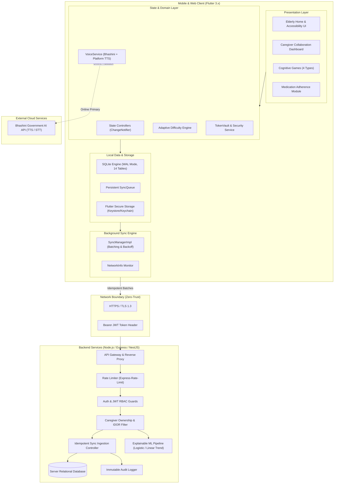
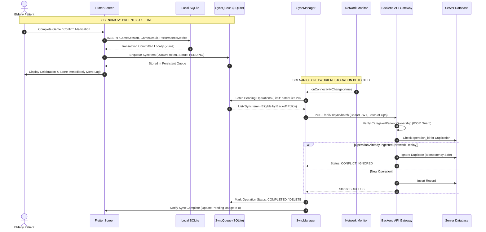
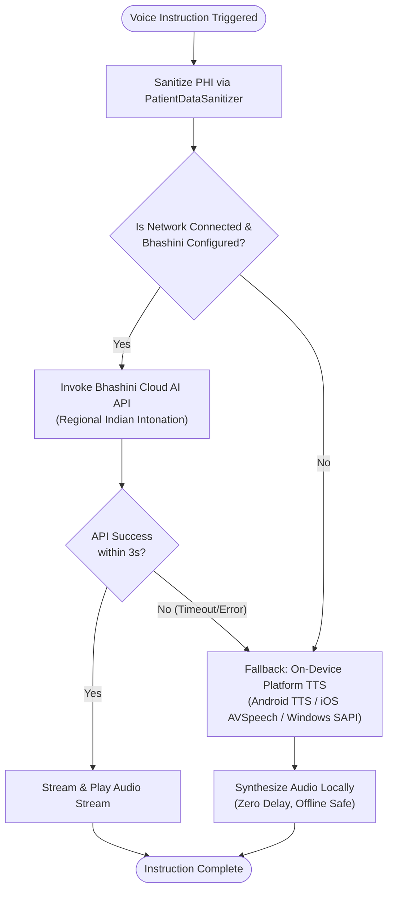
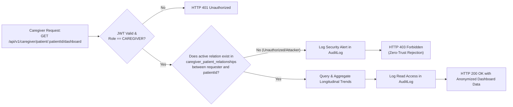

# SmritiSetu — System Architecture & Data Flow Diagrams

> **Document:** SIH Grand Finale Architectural Reference  
> **System Architecture:** Offline-First Dual-Client (Patient/Caregiver) with REST Sync Gateway  

---

## 1. High-Level System Architecture

---

## 2. Offline-First Write & Synchronization Flow

This sequence visualizes what happens when an elderly patient plays a game or confirms medication while offline, and how synchronization reconciles automatically when connection returns.

---

## 3. Dual-Tier Regional Voice Synthesis Architecture

How the speech engine ensures zero failures even during network blackouts in remote North-Eastern villages:

---

## 4. Caregiver Zero-Trust Security & Authorization Architecture

How SmritiSetu strictly prevents Insecure Direct Object References (IDOR) and unauthorized surveillance:

