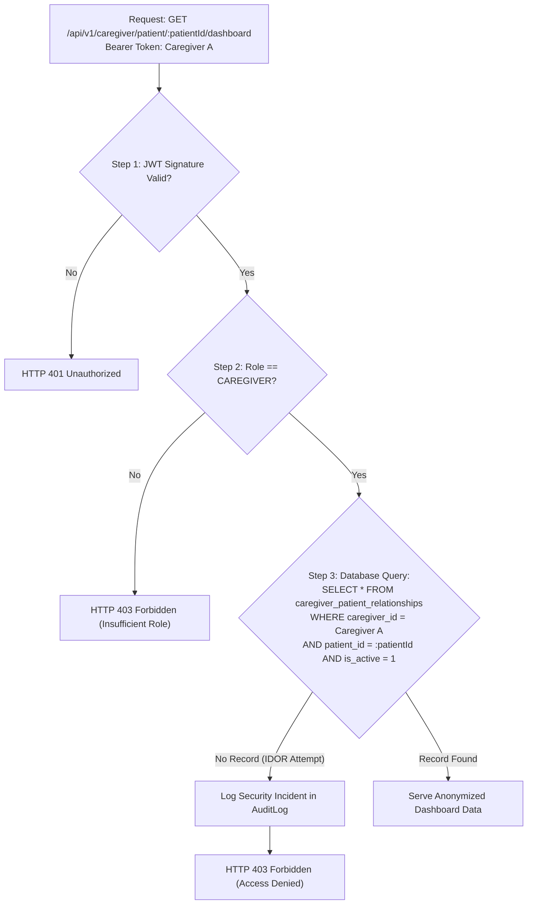

# SmritiSetu — Security, Privacy & Compliance Architecture

> **Document:** SIH Grand Finale Technical Deep Dive  
> **Topic:** Authentication, Authorization, IDOR Defense, Secure Storage, and DPDP Compliance  
> **Security Posture:** Zero-Trust • Defense-in-Depth • OWASP Mobile & API Top 10 Compliant  

---

## 1. Zero-Trust Security Philosophy

In geriatric and cognitive healthcare systems, security cannot be an afterthought. SmritiSetu enforces a **Zero-Trust Architecture**:
- Every client request is authenticated and authorized on every call.
- The server never trusts client-supplied identifiers (`patientId` or `userId`) without verifying cryptographic tokens and server-side relational ownership tables.
- Patient health records and behavioral telemetry are strictly isolated from unauthorized caregivers.

---

## 2. Authentication & Credential Architecture

### 2.1 Password Hashing & Secret Vaulting
- All passwords are encrypted using **bcrypt** with a minimum work factor of 10 (`saltRounds: 10`).
- Registration enforces strong password criteria (minimum 8 characters, uppercase, lowercase, numbers, and special characters).
- User enumeration defenses: Authentication failures for invalid passwords or non-existent usernames return identical generic `HTTP 401 Unauthorized` responses without timing leaks.

### 2.2 Dual-Token Architecture (Access + Refresh)
- **Short-Lived Access Tokens**: Signed JWT with 15-minute expiration (`expiresIn: 15m`).
- **Long-Lived Refresh Tokens**: Securely stored in the backend with 7-day expiration; supports instant revocation if a device is reported lost.
- **Client Storage**: Tokens are stored via [`TokenVault`](file:///d:/SIH%20hackathon/mobile/lib/core/security/secure_storage_service.dart) backed by `FlutterSecureStorage` (hardware-backed Android Keystore and iOS Keychain). Tokens are never written to unencrypted `SharedPreferences` or local SQLite plain text.

---

## 3. Caregiver Authorization & Insecure Direct Object Reference (IDOR) Defense

### The Threat: Insecure Direct Object Reference (IDOR)
In poorly designed healthcare portals, an authenticated Caregiver A can simply alter the URL to `/api/v1/caregiver/patient/patient_B/dashboard` and spy on Patient B’s cognitive scores and medication schedules.

### SmritiSetu's Relational Authorization Guard
SmritiSetu implements strict server-side **Ownership Verification** ([`OwnershipGuard`](file:///d:/SIH%20hackathon/backend/src/common/guards/ownership.guard.ts) and [`CaregiverAuthorizationServiceImpl`](file:///d:/SIH%20hackathon/mobile/lib/features/caregiver/data/services/caregiver_authorization_service_impl.dart)):

Even if an attacker guesses or intercepts another patient’s UUID, access is rejected with `HTTP 403 Forbidden`, and an immutable security alert is logged.

---

## 4. Protected Health Information (PHI) & DPDP Compliance

In compliance with India's **Digital Personal Data Protection Act (DPDP 2023)**:

1. **Patient Data Sanitizer**: Before any text is synthesized into audio via external cloud speech engines (such as Bhashini), [`PatientDataSanitizer`](file:///d:/SIH%20hackathon/mobile/lib/features/voice/data/services/patient_data_sanitizer.dart) strips patient names, surnames, and specific clinical diagnosis terms (*"Alzheimer's"*, *"Dementia"*), passing only dosage instructions.
2. **Local Data Isolation**: If an elderly user does not wish to sync data to the cloud, SmritiSetu operates 100% locally. Zero telemetry leaves the phone unless the caregiver explicitly links their account.
3. **Audit Logging**: Every access to patient records—whether by a caregiver viewing trends or a sync job updating logs—is recorded in an immutable SQLite audit log table (`DatabaseConstants.tableAuditLogs`).

---

## 5. Rate Limiting, Input Validation & Network Hardening

| Defense Layer | Implementation Technique | Protection Provided |
| :--- | :--- | :--- |
| **API Rate Limiting** | `express-rate-limit` middleware | Throttles brute-force password guessing (100 req/15min) and API denial of service. |
| **Input Whitelisting** | NestJS/Express `ValidationPipe(whitelist: true, forbidNonWhitelisted: true)` | Rejects unknown, injected, or prototype-polluted JSON payload fields. |
| **Idempotency Safeguard** | UUIDv4 transaction tokens with server transaction deduplication | Replays of network packets return `CONFLICT_IGNORED` without duplicating database rows. |
| **Environment Isolation** | `AppConfig` (`development`, `staging`, `production`) | Production mode rejects weak secrets (`JWT_SECRET < 32 chars`), disables console logs, and enforces HTTPS. |

---

## 6. OWASP Mobile Top 10 Mapping

| OWASP Mobile Risk | SmritiSetu Mitigation |
| :--- | :--- |
| **M1: Improper Credential Usage** | Short-lived JWTs (15m); hardware keystore vaulting; zero hardcoded passwords. |
| **M2: Inadequate Supply Chain Security** | Zero redundant third-party libraries; dependencies pinned and audited. |
| **M3: Insecure Authentication** | Role-based JWT verification; generic error responses preventing username enumeration. |
| **M4: Insufficient Input/Output Validation** | Strict DTO validation and input parameter sanitization on all endpoints. |
| **M5: Insecure Communication** | Enforces TLS 1.3 in staging and production; no cleartext HTTP in production builds. |
| **M6: Inadequate Privacy Controls** | PHI sanitization before external API calls; zero non-essential telemetry collection. |
| **M7: Insufficient Binary Protections** | Tree-shaken release bundles; Flutter compile-to-native AOT binary. |
| **M8: Security Misconfiguration** | Production configuration enforces production secrets; dev mocks disabled. |
| **M9: Insecure Data Storage** | Hardware-backed encrypted storage for tokens; local SQLite protected by OS sandbox. |
| **M10: Insufficient Cryptography** | Industry-standard bcrypt password hashing; SHA-256 / AES-256 platform keystores. |
