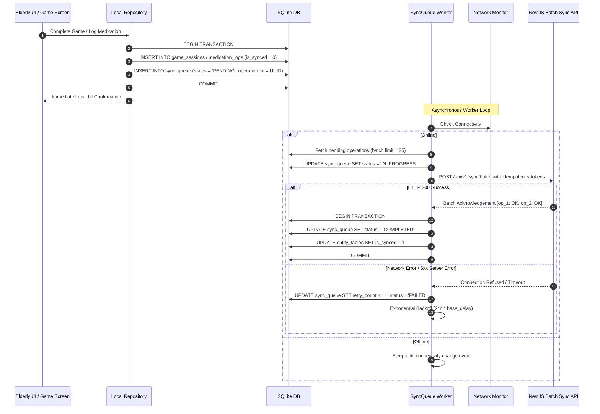

# SmritiSetu — Offline-First Synchronization Architecture

## 1. Overview & Core Philosophy

In the North Eastern Region of India, cellular connectivity is frequently interrupted by undulating terrain, landslides, and remote infrastructure.  
Therefore, **offline is the normal operating state**, not an exceptional error condition.

### Guiding Principles:
1. **Zero UI Network Blocking:** The user interface interacts exclusively with local SQLite storage. No UI button or screen transition ever awaits a network roundtrip.
2. **Deterministic Idempotency:** Any sync operation can be executed multiple times without corrupting state or creating duplicate game sessions or medication logs.
3. **Data Loss Prevention:** Transactions must be committed to local durable disk before an operation is considered finished.
4. **Append-Only Telemetry:** Game sessions, trial metrics, and medication adherence records are strictly append-only.

---

## 2. Synchronization Pipeline



---

## 3. Sync Queue Data Schema

```sql
CREATE TABLE sync_queue (
    operation_id TEXT PRIMARY KEY,       -- Client-generated UUIDv4 (Idempotency Key)
    entity_id TEXT NOT NULL,             -- Primary key of the entity being synced
    entity_type TEXT NOT NULL,           -- 'GAME_SESSION', 'GAME_RESULT', 'MEDICATION_LOG', etc.
    operation_type TEXT CHECK(operation_type IN ('INSERT', 'UPDATE', 'DELETE')) NOT NULL,
    payload_json TEXT NOT NULL,          -- Full serialized entity state
    timestamp TEXT NOT NULL,             -- ISO 8601 UTC timestamp
    retry_count INTEGER DEFAULT 0,       -- Tracks failed attempts
    sync_status TEXT CHECK(sync_status IN ('PENDING', 'IN_PROGRESS', 'FAILED', 'COMPLETED')) DEFAULT 'PENDING',
    last_error TEXT                      -- Debugging error message from last attempt
);
```

---

## 4. Conflict Resolution Strategy

| Entity Category | Sync Pattern | Conflict Resolution Strategy |
|---|---|---|
| **Cognitive Game Sessions & Results** | Append-Only | **Strictly Idempotent Insert.** The server checks `WHERE id = :id`. If already present, returns HTTP 200 OK without re-inserting. |
| **Medication Adherence Logs** | Append-Only | **Idempotent Timestamp Check.** Cannot mark the same dose taken twice; duplicate payloads are treated as no-ops. |
| **User & Patient Profile Settings** | Mutable State | **Last-Write-Wins (LWW) via UTC Timestamp.** If the server record has a newer `updated_at` timestamp, the client change is rejected or merged. |

---

## 5. Batch Synchronization API Specification

### Endpoint: `POST /api/v1/sync/batch`
- **Headers:**
  - `Authorization: Bearer <JWT_TOKEN>`
  - `Content-Type: application/json`
  - `X-Client-Version: 1.0.0`

### Request Payload:
```json
{
  "batchId": "b1a8519e-9533-4f9e-a89e-ecbe5d5b7a1e",
  "clientTimestamp": "2026-09-12T05:40:00.000Z",
  "operations": [
    {
      "operationId": "op_c7d91e12-40f4-411a-a621-e070c79133a8",
      "entityType": "GAME_SESSION",
      "operationType": "INSERT",
      "entityId": "ses_4e04772f-53ce-4275-9279-d5c643906201",
      "payload": {
        "id": "ses_4e04772f-53ce-4275-9279-d5c643906201",
        "patientId": "pat_112233",
        "gameType": "FAMILY_FACE_MATCH",
        "startTime": "2026-09-12T05:30:00.000Z",
        "endTime": "2026-09-12T05:33:15.000Z",
        "difficultyLevel": 2,
        "isCompleted": 1
      }
    }
  ]
}
```

### Response Payload:
```json
{
  "batchId": "b1a8519e-9533-4f9e-a89e-ecbe5d5b7a1e",
  "processedAt": "2026-09-12T05:40:01.210Z",
  "results": [
    {
      "operationId": "op_c7d91e12-40f4-411a-a621-e070c79133a8",
      "status": "SUCCESS",
      "serverSyncTimestamp": "2026-09-12T05:40:01.200Z"
    }
  ]
}
```
